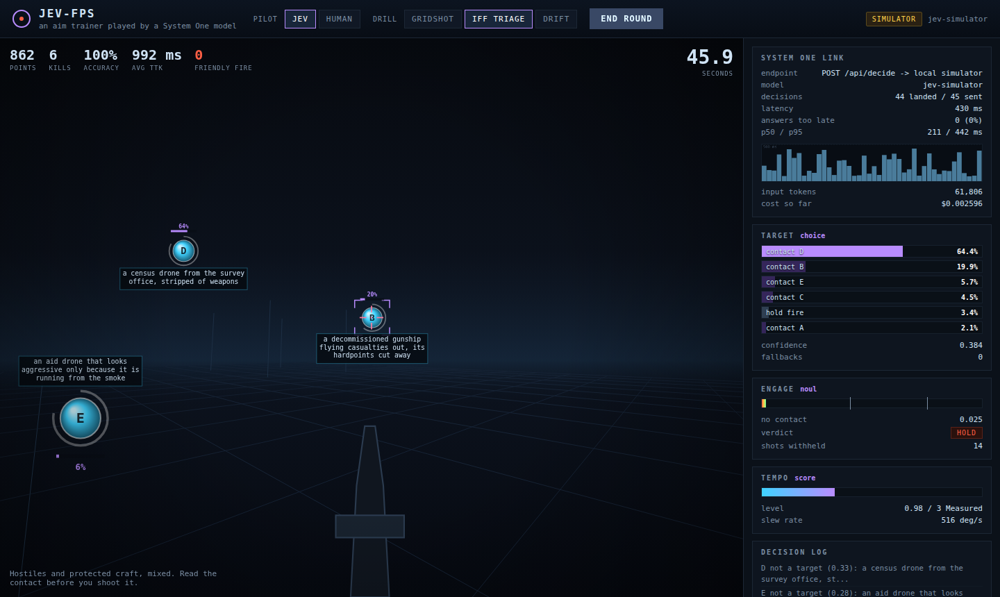

# JEV-FPS

An aim trainer — fixed gun, contacts pop up in front of you, shoot them before they
leave — where the gunner is **[Jev](https://typesafe.ai/blog/introducing-system-one-models-and-jev)**,
TypeSafe AI's System One model.

The point is the fit. Jev does not write text; it answers typed questions against a
state and returns the answers with calibrated probabilities, end to end in 70–500 ms.
That is useless for an essay and close to ideal for the thing a human does without
thinking: *which one do I shoot, and is it something I should be shooting at all.*



## Quick start

```bash
npm install
npm run build
npm start                    # http://127.0.0.1:8787
```

With no API key the game runs against a bundled **simulator** that answers the same
questions over the same wire shape, and the HUD says `SIMULATOR` in the corner. For
the real model:

```bash
cp .env.example .env         # then put your key in TYPESAFE_API_KEY
npm start                    # HUD switches to JEV LIVE
```

Keys come from the [TypeSafe console](https://console.typesafe.ai/settings/keys). The key
stays on the server; the browser only ever sees decisions.

## How Jev is wired in

Every ~90 ms the game takes a snapshot of the range — contacts with their angular
offset from the crosshair, apparent size, range, drift, how long before they leave —
and sends it as `state` with **three questions in one call**
([speculative fan-out](https://docs.typesafe.ai/patterns/fan-out)):

| question | primitive | what it decides |
| --- | --- | --- |
| `target` | [Choice](https://docs.typesafe.ai/primitives/choice) | which contact to slew onto next, or `hold` |
| `engage` | [Noul](https://docs.typesafe.ai/primitives/noul) | whether the contact under the crosshair may be shot |
| `tempo`  | [Score](https://docs.typesafe.ai/primitives/score) | how hard to push the sight right now |

One round trip produces a complete aim command. The split of labour is the one
TypeSafe's docs argue for — [code stays in
control](https://docs.typesafe.ai/concepts/how-to-build-with-system-one), the model
answers narrow questions:

- **Jev decides** which contact, whether to shoot it, and the tempo.
- **Code decides** everything continuous and everything with a deadline: the slew
  curve, when the sight is actually on, rate of fire, recoil recovery, and what to do
  while a decision is still in flight.

Because the sight is driven by code, aim is mechanically perfect in every mode. What
varies between a good round and a bad one is entirely the model's: target priority,
identification, and how much of the clock the round trip eats.

### The parts worth looking at

**`src/shared/brain.ts`** builds the request and interprets the answers. Options and
rubrics are [structured, not
prose](https://docs.typesafe.ai/primitives/advanced) — each Choice option is the
contact's geometry as JSON, plus what the gunner can make out through the sight.

**Latency is the game mechanic.** A decision describes a board that is already ~200 ms
old. The gun keeps executing the last command while the next is in flight, and the HUD
counts answers that *outlived their contact* — calls whose contact was gone by the
time they landed. In the fast drills that is routinely 20–45% of calls, which is the honest cost of putting a
model in a reflex loop, and why the model is asked *which* and not *where*.

**Thresholds live in code, not in the model.** Jev reports `engage` as a probability;
`DEFAULT_POLICY` turns it into a verdict:

```
engage >= 0.75  ->  fire
engage <= 0.40  ->  hold, and the contact is written off for good
in between      ->  unsure: the trigger stays shut, the contact is parked
                    for 1.5 s and then looked at again with a fresh snapshot
```

That middle band is the [self-consistency
pattern](https://docs.typesafe.ai/cookbooks/consistency_noul_cookbook.md) — an
uncertain answer is not a yes and not a no, it is a *don't act yet*. All three
thresholds are sliders in the panel; drag `fire` down to 0.5 in IFF triage and watch
the friendly-fire count climb.

**Confidence gates the target choice.** When `confidence` on the Choice answer falls
below `minConfidence`, code ignores the answer and picks a target with a boring
distance heuristic instead ([confidence-gated
routing](https://docs.typesafe.ai/patterns/confidence-routing)). The gate sits low
(0.12) on purpose: a flat distribution over six interchangeable hostiles is
indifference, not doubt, and the cost of a wrong pick there is a few hundred
milliseconds. In IFF triage the same flatness matters more, which is what the slider
is for. The fallback can aim
at a protected craft — it knows nothing about IFF — but it cannot shoot one, because
the trigger still needs a `fire` clearance from Jev. Two independent gates, one
failure each.

**Clearances are keyed to contact identity, not to the letter.** Display letters
(A–H) are recycled as contacts come and go; a refusal must not outlive the contact it
was about.

## The drills

| drill | what it tests |
| --- | --- |
| **GRIDSHOT** | Six hostiles, nothing to identify. Pure target priority under a clock. |
| **IFF TRIAGE** | Hostiles and protected craft mixed, each with a line of description. Killing a protected craft costs 300; letting one leave untouched pays 10. Reading the contact is the whole drill. |
| **DRIFT** | Hostiles that move, so the sight has to track. |

IFF triage carries the interesting contacts: a *medevac hull with a turret bolted into
the side door* (shoot it) and a *decommissioned gunship flying casualties out, its
hardpoints cut away* (do not). Those are in `src/web/engine/contacts.ts`, and they are
where a model that reads the sentence beats one that matches keywords.

Switch the pilot to **HUMAN** to play the same drills with a mouse under the same
scoring.

## Watching it think

The right-hand panel is the whole integration, live: the endpoint in use, the decision
latency histogram against Jev's published 500 ms ceiling, the full Choice distribution
over contacts (also drawn over each contact on the range), the `engage` probability
against its gates, the tempo score, the running input-token count and cost at
$0.042/Mtok, and the raw request and response JSON of the last call.

## Headless

```bash
node scripts/bench.mjs --mode triage --seconds 30          # bundled simulator
node scripts/bench.mjs --mode triage --server http://127.0.0.1:8787   # the server's brain
node scripts/bench.mjs --mode gridshot --seconds 20 --trace

npm start &
node scripts/smoke.mjs --mode gridshot --seconds 20        # needs playwright
```

`bench.mjs` runs the same `World` and `JevPilot` the browser runs, with no browser, and
prints a JSON summary — the way to measure a policy change, or the real model against
the simulator.

## The simulator

`src/shared/simulator.ts` is **not** Jev. It answers the same questions with a
heuristic — geometry and urgency for the Choice, a keyword lexicon for the
identification Noul — draws a latency from Jev's published band, and reports estimated
token usage. It exists so the game is playable and testable with no key, and it is
labelled `SIMULATOR` everywhere it answers. Its keyword reading is exactly where it is
worse than the real thing: compound descriptions are the ones it gets wrong.

## Layout

```
src/shared/     protocol types, the TypeSafe wire types, the brain, the simulator
src/server/     static server, /api/decide, the SDK-backed Jev client
src/web/        the game: engine (math, world, renderer), pilot, HUD, transport
public/         index.html + style.css; compiled modules land in public/js/
scripts/        headless bench + browser smoke test
```

Built with the official [`@typesafe-ai/sdk`](https://docs.typesafe.ai/sdk/javascript)
on the server. No other runtime dependencies, no bundler, no CDN — TypeScript compiles
to ES modules the browser loads directly.
